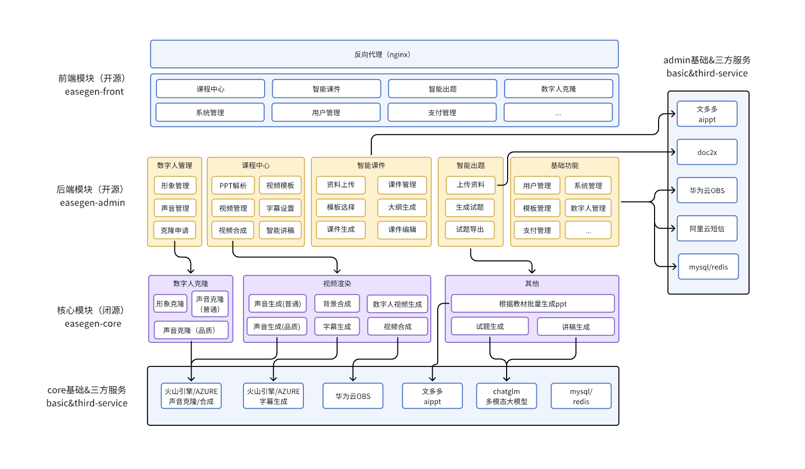

  <a href="./README.md">English</a> |
  <a href="./README_cn.md">简体中文</a> 

I am a full-stack engineer, a practitioner of the AGI era super individual, hoping to contribute to AI development through open source.

If this project has helped you, remember to Star and follow, which would be great encouragement and support for me.

## 🐶 Beginner's Guide

* nodejs > 16.18.0 && pnpm > 8.6.0 (mandatory use of pnpm)
* Demo URL 【Vue3 + element-plus】: <http://1.95.87.0:48083> Please register to experience
* Startup documentation, operation manual: Please join the discard group to get it.
  discard:https://discord.gg/q2RK3sEQwW
* Project collaboration & technical exchanges: add WeChat, note easegen:

## 🐯 Platform Introduction

**easegen**, an open-source digital human course creation platform.

* Frontend is implemented based on [yudao-ui-admin-vue3](https://gitee.com/yudaocode/yudao-ui-admin-vue3).
* Backend is implemented based on [ruoyi-vue-pro](https://gitee.com/zhijiantianya/ruoyi-vue-pro).
* Intelligent courseware is realized based on [Wenduoduo](https://easegen.docmee.cn).
* Document parsing is implemented using [doc2x](https://doc2x.noedgeai.com/).

* Course creation

* Intelligent Courseware

* Intelligent Test Creation

*  [Sample Course](https://www.bilibili.com/video/av113088116297160/)

## ✨ Core Features

### 📱 2D Digital Human Course Creation
- **Course Template System**: Multiple preset templates for quick course creation
- **Intelligent Script Generation**: AI-powered automatic course narration generation
- **Digital Human Customization**: Personalized appearance and voice customization
- **PPT Integration**: Automatic PPT parsing and digital human lecture video generation
- **Text Dubbing**: Text-to-speech with multiple voice options
- **SSML Syntax**: Fine-grained voice control (pitch, pause, speed, etc.)

### 🎬 3D Digital Human Course Creation (NEW)
Support for creating 3D digital human video courses with PPT presentations.

**Main Features:**
- **3D Scene Selection**
  - Multiple studio scene options (minimalist, business, conference, etc.)
  - Support for 16:9 and 9:16 aspect ratios

- **3D Digital Human Selection**
  - Multiple 3D digital human character models
  - Different genders, ages, and styles available

- **Voice Selection**
  - Multiple voice options
  - Support for Chinese and other languages

- **PPT Upload & Parsing**
  - Automatic PPT/PDF upload and parsing
  - Extract slides and narration content
  - Drag-and-drop sorting and scene management

- **Video Composition**
  - Combine 3D scenes, digital humans, voices, and PPT slides
  - Generate 3D digital human narrated PPT videos
  - Content validation before composition
  - Automatic saving functionality

### 🤖 AI Intelligent Assistance
- **Intelligent Courseware Generation**: Auto-generate PPT courseware from documents
- **AI Question Generation**: Intelligently generate questions based on course content
- **Document Parsing**: Smart parsing of multiple document formats
- **Script Optimization**: AI-assisted optimization of lecture text

## 🗺️ Development Roadmap

Here are the major features and improvements we plan to implement in the future:
- [x] Support for course templates
- [x] Support for intelligent script generation
- [x] Support for digital human image and voice customization
- [x] Support for docker quick deployment
- [x] Support for AI-generated scriptwriting
- [x] Add text dubbing function
- [x] SSML syntax support for voice
- [ ] Add digital human rapid cloning mode
- [ ] Add mouthpiece video synthesis function
- [ ] Adding lesson plan generation
- [ ] Convert lesson plans to courseware and generate controllable PPTs
- [ ] Support for real-time digital human teaching
- [ ] Adding an intelligent assistant

## Architecture Diagram

## Technology Stack

| Framework                                                               | Description         | Version |
|------------------------------------------------------------------------|---------------------|---------|
| [Vue](https://staging-cn.vuejs.org/)                                   | Vue framework       | 3.3.8   |
| [Vite](https://cn.vitejs.dev//)                                        | Development tool    | 4.5.0   |
| [Element Plus](https://element-plus.org/zh-CN/)                        | Element Plus        | 2.4.2   |
| [TypeScript](https://www.typescriptlang.org/docs/)                     | Superset of JS      | 5.2.2   |
| [pinia](https://pinia.vuejs.org/)                                      | Vue Store replacement for Vuex5 | 2.1.7 |
| [vueuse](https://vueuse.org/)                                          | Utility collection  | 10.6.1  |
| [vue-i18n](https://kazupon.github.io/vue-i18n/zh/introduction.html/)   | Internationalization| 9.6.5   |
| [vue-router](https://router.vuejs.org/)                                | Vue Router          | 4.2.5   |
| [unocss](https://uno.antfu.me/)                                        | Atomic CSS          | 0.57.4  |
| [iconify](https://icon-sets.iconify.design/)                           | Online Icon Library | 3.1.1   |
| [wangeditor](https://www.wangeditor.com/)                              | Rich Text Editor    | 5.1.23  |

## Deployment Manual
* [Docker Deployment Manual](https://ozij45g3ts.feishu.cn/docx/V1qmd6gsWobsRWxJFepcdrnbnXF)
* [Backend Deployment Manual](https://ozij45g3ts.feishu.cn/docx/EgS3dm1HtoKOPkxReEQcn3MCncg)
* [Frontend Deployment + System Initialization Manual](https://ozij45g3ts.feishu.cn/docx/OIN8daguXoTzESx8nxFcJOvsnWc)

## Development Tools

Recommended VS Code development with the following plugins:

| Plugin Name                        | Functionality        |
|------------------------------------|----------------------|
| Vue - Official                     | Vue and TypeScript Support |
| unocss                             | unocss for vscode    |
| Iconify IntelliSense               | Iconify preview and search |
| i18n Ally                          | Internationalization tips |
| Stylelint                          | CSS formatting       |
| Prettier                           | Code formatting      |
| ESLint                             | Script code checks   |
| DotENV                             | Highlighting env files |

## 🔥 Backend

Spring Boot:

① easegen-admin: <https://github.com/taoofagi/easegen-admin>

### Additional Features
Refer to [ruoyi-vue-pro](https://gitee.com/zhijiantianya/ruoyi-vue-pro#-%E5%86%85%E7%BD%AE%E5%8A%9F%E8%83%BD)

## 🌟 Star History

## 🤝 Awards
1. [2024 Huacai Cup Compute Power Competition Finals Second Prize, Project No. L01610474065](https://mp.weixin.qq.com/s/SE10-cxLVurf0BfAMaegmw)]

## 🧾 Disclaimer/License

1. `Code`: The `easegen-front` code is released under the `Apache` license for academic and commercial use.
2. `AIGC`: This project aims to positively impact the AI-generated text, speech, and video field. Users are granted the freedom to use this tool to create text, speech, and videos, but they should comply with local laws and use it responsibly. Developers bear no responsibility for any misuse of the tool by users.
