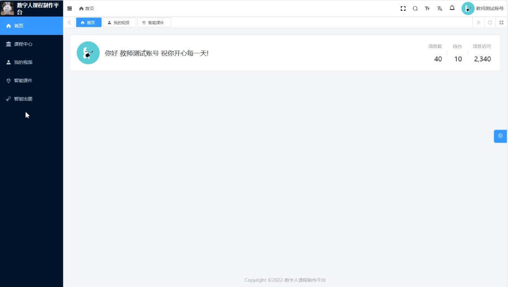

我 全栈工程师，AGI时代超级个体践行者，希望通过开源为AI发展做贡献。

如果这个项目让你有所收获，记得 Star 关注哦，这对我是非常不错的鼓励与支持。

## 🐶 新手必读

* nodejs > 16.18.0 && pnpm > 8.6.0 (强制使用pnpm)
* 演示地址【Vue3 + element-plus】：<http://36.103.251.108:48083> 请注册体验
* 启动文档、操作手册：请加入飞书群获取
  
* 项目合作&技术交流加微信，备注easegen：

## 🐯 平台简介

**easegen**，开源数字人课程制作平台。

* 前端基于 [yudao-ui-admin-vue3](https://gitee.com/yudaocode/yudao-ui-admin-vue3) 实现
* 后端基于 [ruoyi-vue-pro](https://gitee.com/zhijiantianya/ruoyi-vue-pro) 实现
* 智能课件基于[文多多](https://easegen.docmee.cn)实现
* 文档解析基于[doc2x](https://doc2x.noedgeai.com/)实现

* 课程制作

* 智能课件

* 智能出题

*  [样课展示](https://www.bilibili.com/video/av113088116297160/)

## 🗺️ 开发路线图

以下是我们计划在未来实现的主要功能和改进：
- [x] 支持课程模板
- [ ] 支持数字人形象声音定制
- [ ] 支持docker快速部署
- [ ] 声音支持SSML语法
- [ ] 增加教案生成
- [ ] 增加教案转课件，生成可控PPT
- [ ] 支持实时数字人讲课功能
- [ ] 增加智能助理

## 技术栈

| 框架                                                                   | 说明               | 版本     |
|----------------------------------------------------------------------|------------------|--------|
| [Vue](https://staging-cn.vuejs.org/)                                 | Vue 框架           | 3.3.8 |
| [Vite](https://cn.vitejs.dev//)                                      | 开发与构建工具          | 4.5.0  |
| [Element Plus](https://element-plus.org/zh-CN/)                      | Element Plus     | 2.4.2 |
| [TypeScript](https://www.typescriptlang.org/docs/)                   | JavaScript 的超集   | 5.2.2  |
| [pinia](https://pinia.vuejs.org/)                                    | Vue 存储库 替代 vuex5 | 2.1.7 |
| [vueuse](https://vueuse.org/)                                        | 常用工具集            | 10.6.1 |
| [vue-i18n](https://kazupon.github.io/vue-i18n/zh/introduction.html/) | 国际化              | 9.6.5  |
| [vue-router](https://router.vuejs.org/)                              | Vue 路由           | 4.2.5  |
| [unocss](https://uno.antfu.me/)                                      | 原子 css          | 0.57.4  |
| [iconify](https://icon-sets.iconify.design/)                         | 在线图标库            | 3.1.1  |
| [wangeditor](https://www.wangeditor.com/)                            | 富文本编辑器           | 5.1.23 |

## 部署手册
https://ozij45g3ts.feishu.cn/docx/OIN8daguXoTzESx8nxFcJOvsnWc

## 开发工具

推荐 VS Code 开发，配合插件如下：

| 插件名                           | 功能                  |
|-------------------------------|---------------------|
| Vue - Official                | Vue 与 TypeScript 支持 |
| unocss                        | unocss for vscode   |
| Iconify IntelliSense          | Iconify 预览和搜索       |
| i18n Ally                     | 国际化智能提示             |
| Stylelint                     | Css    格式化          |
| Prettier                      | 代码格式化               |
| ESLint                        | 脚本代码检查              |
| DotENV                        | env 文件高亮            |

## 🔥 后端

Spring Boot：

① easegen-admin：<https://github.com/taoofagi/easegen-admin>

### 若依其他系统功能
请参考[ruoyi-vue-pro](https://gitee.com/zhijiantianya/ruoyi-vue-pro#-%E5%86%85%E7%BD%AE%E5%8A%9F%E8%83%BD)

## 🌟 Star History

## 🧾 免责声明/许可

1. `代码`：`easegen-front` 的代码采用 `Apache` 许可证发布，学术用途和商业用途都可以。
2. `AIGC`：本项目旨在积极影响基于人工智能的文字、语音、视频生成领域。用户被授予使用此工具创建文字、语音、视频的自由，但他们应该遵守当地法律，并负责任地使用。开发人员不对用户可能的不当使用承担任何责任。